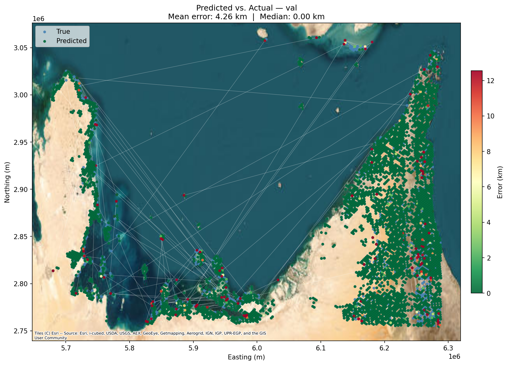
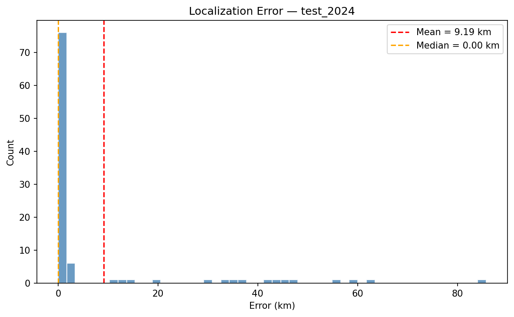

# Vision-Based Absolute Positioning System (VBAPS)
### Terrain Relative Navigation for GPS-Denied UAVs via Deep Learning

> Region: UAE/Qatar Coastline (Persian Gulf) · Imagery: Sentinel-2 · 2022 train / 2024 test  
> 4,498 H3 Level-7 hexagonal classes (~2.5 km per cell) · SeCo ResNet-50 backbone

---

<p align="center">
  
</p>
<p align="center"><em>Iteration 2 validation predictions (green = correct hexagon, red = misclassification) overlaid on Esri satellite basemap. Errors cluster in low-feature coastal and desert regions.</em></p>

---

## Overview

VBAPS is a Terrain Relative Navigation (TRN) prototype that estimates the **absolute geographic position of a UAV** using only a downward-facing camera feed. The system frames position estimation as a **multi-class geographic classification problem**: the Persian Gulf coastline is subdivided into ~4,500 hexagonal cells, and the model predicts which cell the input image belongs to. The predicted coordinate is the centre of the top-1 classified hexagon.

A distance error of **0 km** means the correct hexagon was selected — the hexagon itself acts as the system's spatial resolution floor. Reducing cell size (e.g. H3 Level 8 or 9) would increase resolution but requires proportionally more training data and compute, a trade-off constrained by available hardware.

The project was developed under significant **hardware and data constraints** (single Apple Silicon laptop, no GPU cluster), and demonstrates that satisfactory geolocation results can be achieved with limited compute using the right training strategy.

---

## The Problem

GPS-denied navigation is a critical capability gap for UAVs operating in contested or degraded environments. Traditional TRN systems rely on pre-loaded terrain databases and laser altimetry. This project explores whether a deep learning model trained entirely on freely available satellite imagery can serve as a lightweight, passive positioning system.

---

## Approach

### Geographic Classification (PlaNet Paradigm)

The core framing follows **PlaNet** (Weyand et al., 2016): treat visual geolocation as classification over geographic cells rather than regression. The model learns to classify which spatial bucket a given image belongs to.

### H3 Hexagonal Spatial Indexing

Rather than rectangular grid cells, we use **Uber's H3 hierarchical hexagonal indexing** at Level 7 (~2.5 km diameter per cell). Hexagons ensure all neighbours are equidistant from the centre, eliminating the corner-distance artefacts of square grids.

### Shannon Entropy Filtering

To prevent visual aliasing where open ocean or featureless desert tiles are visually indistinguishable — a **Shannon Entropy filter** (threshold ≥ 5.2 bits) discards low-feature regions. This restricts the learnable map to structurally rich areas (coastlines, urban grids, islands, harbours). Some low-feature regions still pass through the filter, and these are where most misclassifications occur.

### SeCo Pretrained Backbone

The backbone is a **ResNet-50 pretrained with Seasonal Contrast (SeCo)** (Mañas et al., 2021), a self-supervised method designed for Sentinel-2 satellite imagery. SeCo features encode spectral and textural patterns specific to the Sentinel-2 sensor, outperforming ImageNet-pretrained weights for overhead imagery.

### UAV Feed Simulation

The UAV camera footprint is simulated by extracting a **random 224×224 pixel crop at a random heading angle** (0–360°) from a 512×512 master tile, with no resizing. This preserves the native **10 m/px GSD** of Sentinel-2 and simulates the yaw variation of a UAV in flight.

### Temporal Evaluation

The training set uses **2022 imagery**; the test set is independently acquired from **2024** for the same geographic hexagons. This 2-year temporal gap tests robustness to seasonal change, new construction (the UAE develops extremely rapidly), and atmospheric variation. Test images also undergo random rotation at inference.

---

## Training Strategy

Training was carried out in **two iterations**, each building on the previous checkpoint:

### Iteration 1 — Frozen Backbone (200 epochs)

The SeCo ResNet-50 backbone was **fully frozen**. Only the classification head (`Linear(2048 → 4498)`) was trained using SGD with cosine annealing. This isolates the quality of SeCo's pretrained representations and establishes a clean baseline.

### Iteration 2 — Full Fine-Tune with Layerwise LR Decay (30 epochs)

Starting from the Iteration 1 checkpoint, the **entire model** was unfrozen and fine-tuned using **AdamW with layerwise learning rate decay**. Each layer group receives an exponentially lower learning rate the deeper it sits in the network:

| Layer Group | Learning Rate |
|-------------|--------------|
| fc (head) | 1 × 10⁻⁴ |
| layer4 | 1 × 10⁻⁵ |
| layer3 | 1 × 10⁻⁶ |
| layer2 | 1 × 10⁻⁷ |
| layer1 | 1 × 10⁻⁸ |
| conv1/bn1 | 1 × 10⁻⁹ |

This strategy preserves the SeCo features in early layers (which are effectively frozen by their negligible LR) while allowing the deeper, more task-specific layers to adapt to the geolocation objective. A 2-epoch linear warmup precedes cosine decay.

---

## Results

### Iteration 1 — Frozen Backbone (best at epoch 180)

| Metric | Validation | Test (2024) | Random Baseline |
|--------|-----------|-------------|-----------------|
| Top-1 | 44.3% | 31.0% | 0.02% |
| Top-3 | 66.1% | 52.0% | 0.07% |
| Top-5 | 75.2% | 62.0% | 0.11% |
| Mean Distance | 39.8 km | 41.0 km | ~206–222 km |

### Iteration 2 — Full Fine-Tune (best at epoch 26)

| Metric | Validation | Test (2024) | Random Baseline |
|--------|-----------|-------------|-----------------|
| Top-1 | **90.5%** | **72.0%** | 0.02% |
| Top-3 | **97.1%** | **83.0%** | 0.07% |
| Top-5 | **98.2%** | **85.0%** | 0.11% |
| Mean Distance | **4.26 km** | **9.19 km** | ~206–222 km |

<p align="center">
  
</p>
<p align="center"><em>Distribution of haversine distance errors on the 2024 test set. Most predictions fall within a single hexagon diameter (~2.5 km).</em></p>

<p align="center">
  
</p>
<p align="center"><em>Sample test predictions: each pair shows the input 224×224 crop (left) alongside the full 512×512 master tile of the predicted hexagon (right). Green border = correct, red = incorrect.</em></p>

### Analysis

**Validation set:** The model achieves 90.5% top-1 accuracy with a mean positional error of 4.26 km well within a single hexagonal cell diameter. Misclassifications are predominantly concentrated in low-feature regions (open coastline, sparse desert) that passed through the entropy filter.

**Test set (2024 imagery):** Despite a 2-year temporal gap and random rotation at inference, the model achieves 72% top-1 accuracy with 10.91 km mean error a **20× improvement** over the random baseline (~206 km). The val-to-test gap is expected given temporal changes in the region (construction, land reclamation, seasonal variation) and is consistent with prior work on temporal domain shift in satellite imagery.

**Iteration improvement:** Fine-tuning improved val top-1 from 44.3% → 90.5% (+46.2 pp) and reduced mean distance from 39.8 km → 4.26 km (9.3× reduction). This demonstrates that the SeCo features, while strong as frozen representations, benefit substantially from task-specific adaptation when done carefully with layerwise LR decay.

---

## Pipeline

```
Google Earth Engine (Sentinel-2 2022)
        │
        ▼
H3 Level-7 Tiling (~4,500 hexagons over Persian Gulf)
        │
        ▼
Shannon Entropy Filter (≥ 5.2) → Sparse Map (4,498 classes)
        │
        ▼
512×512 Master Tiles saved to disk (filename = hex_id)
        │
        ├─── Iteration 1 ──→ Random rotated 224×224 crop → SeCo ResNet-50 (frozen) → fc head (SGD, 200 ep)
        │
        ├─── Iteration 2 ──→ Warm-start from iter1 → Full fine-tune (AdamW, layerwise LR decay, 30 ep)
        │
        └─── Testing ──→ 2024 GEE imagery (same hexagons) + random rotation at inference
```

---

## Spatial Resolution

The system's spatial resolution is determined by the **H3 hexagon level**. At Level 7, each cell has a diameter of ~2.5 km. A correct classification yields 0 km error (measured to the cell centre), meaning the true resolution floor is ~1.25 km. Finer grids (Level 8: ~0.9 km, Level 9: ~0.3 km) would increase resolution but require proportionally more training data and compute a constraint imposed by the hardware limitations of this project (single Apple Silicon laptop, no multi-GPU training).

---

## Technical Stack

| Component | Tool |
|-----------|------|
| Satellite imagery | Google Earth Engine — Sentinel-2 SR Harmonized |
| Spatial indexing | Uber H3 (Level 7) |
| Model | torchvision ResNet-50 + SeCo weights (32.7M params) |
| Augmentation | Albumentations (train), OpenCV (rotated crops) |
| Training | PyTorch — SGD (iter1), AdamW with layerwise LR decay (iter2) |
| Visualization | Matplotlib + contextily (Esri satellite basemap) |
| Hardware | Apple M-series (MPS backend) |

---

## Project Structure

```
VBAPS/
├── src/                    # Core modules
│   ├── train.py            # Training & evaluation loop
│   ├── model.py            # ResNet-50 + SeCo checkpoint loading
│   ├── dataset.py          # H3 dataset & DataLoader construction
│   ├── utils.py            # Haversine, softmax centroid, top-k metrics
│   └── visualize.py        # Geographic scatter, error histogram, prediction grid
├── scripts/                # Data acquisition
│   ├── data_mining.py      # Download Sentinel-2 training tiles via GEE
│   └── fetch_test_set.py   # Download 2024 test tiles via GEE
├── data/                   # Imagery & labels (not included — see below)
├── checkpoints/            # Model weights (not included — see below)
├── assets/                 # README images
├── requirements.txt        # Python dependencies
└── README.md
```

> **Why are `data/` and `checkpoints/` not in the repo?**
> The training imagery (~2.4 GB) and model checkpoints (160–447 MB each) exceed GitHub's file-size limits.
> Both are fully reproducible: run `scripts/data_mining.py` and `scripts/fetch_test_set.py` to download the satellite tiles from Google Earth Engine, then follow the training steps below to generate the checkpoints.

---

## Installation

```bash
# Clone the repository
git clone https://github.com/tomaspmz/vision-based-positioning-system.git
cd vision-based-positioning-system

# Create and activate a virtual environment
python -m venv venv
source venv/bin/activate

# Install dependencies
pip install -r requirements.txt
```

You will also need a [Google Earth Engine](https://earthengine.google.com/) project for data acquisition. Create a `.env` file in the project root:

```
GEE_PROJECT=your-gee-project-id
```

---

## Usage

```bash
# 1. Acquire training data (2022 Sentinel-2)
python scripts/data_mining.py

# 2. Acquire test data (2024 Sentinel-2, same hexagons)
python scripts/fetch_test_set.py --n 100

# 3. Iteration 1 — frozen backbone, 200 epochs
python src/train.py --iteration 1 --epochs 200 --batch_size 32 --lr 0.01

# 4. Iteration 2 — full fine-tune from iter1 checkpoint, 30 epochs
python src/train.py --iteration 2 --epochs 30 --batch_size 32

# 5. Evaluate a specific iteration (loads iterN_best.pt, runs val + test, generates plots)
python src/train.py --iteration 2 --eval-only

# 6. Generate visualizations standalone
python src/visualize.py --checkpoint checkpoints/iter2_best.pt
```

---

## References

1. **Weyand, T., Kostrikov, I., & Philbin, J.** (2016). *PlaNet - Photo Geolocation with Convolutional Neural Networks.* ECCV 2016.

2. **Mañas, O., Lacoste, A., Giró-i-Nieto, X., Karatzas, D., & Rodriguez, P.** (2021). *Seasonal Contrast: Unsupervised Pre-Training from Uncurated Remote Sensing Data.* ICCV 2021.

3. **Uber Engineering.** (2018). *H3: Uber's Hexagonal Hierarchical Spatial Index.*

4. **European Space Agency.** *Sentinel-2 Mission.* Copernicus Programme.

5. **He, K., Zhang, X., Ren, S., & Sun, J.** (2016). *Deep Residual Learning for Image Recognition.* CVPR 2016.
